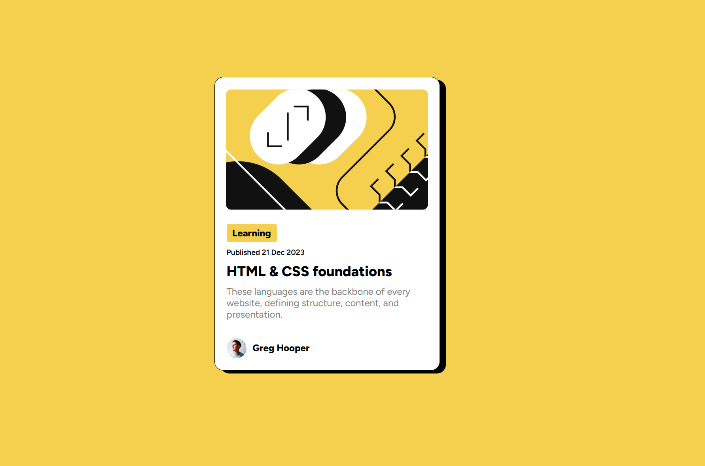

# 😶‍🌫️ Blog Preview Card - Page Solution

This is my first solution to the [Blog Preview Card page challenge on Frontend Mentor](https://www.frontendmentor.io/challenges/blog-preview-card-ckPaj01IcS) and took me about 2 hours to complete. Frontend Mentor challenges help you improve your coding skills by building realistic projects. If you are a beginner you really need to try this!

## 🪞 Screenshots

## 🎥 Live WebSite

- Live Site URL: [Add live site URL here](https://alexandru-ghergu.github.io/social-links-profile-main/)

## 🪄 Technologies

- `HTML5`
- `CSS`
- `Flexbox`
